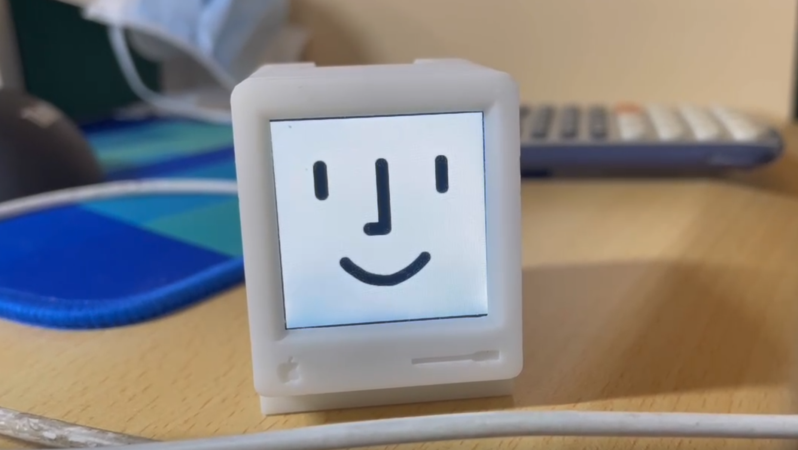
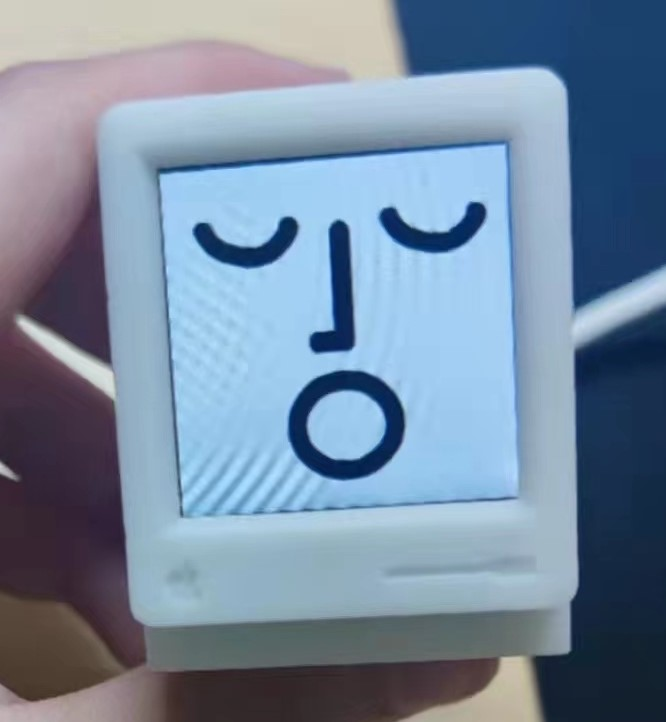
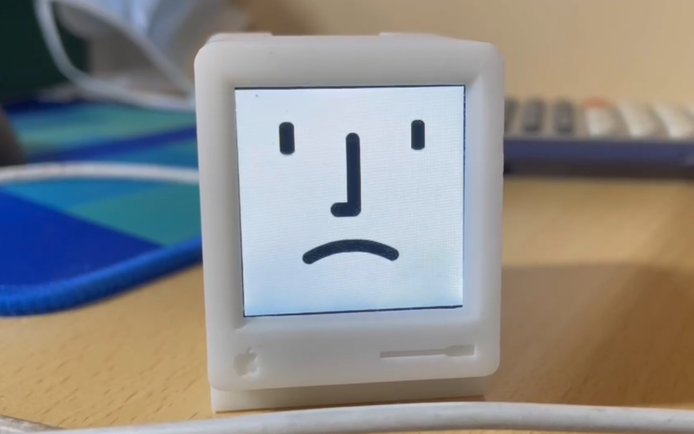
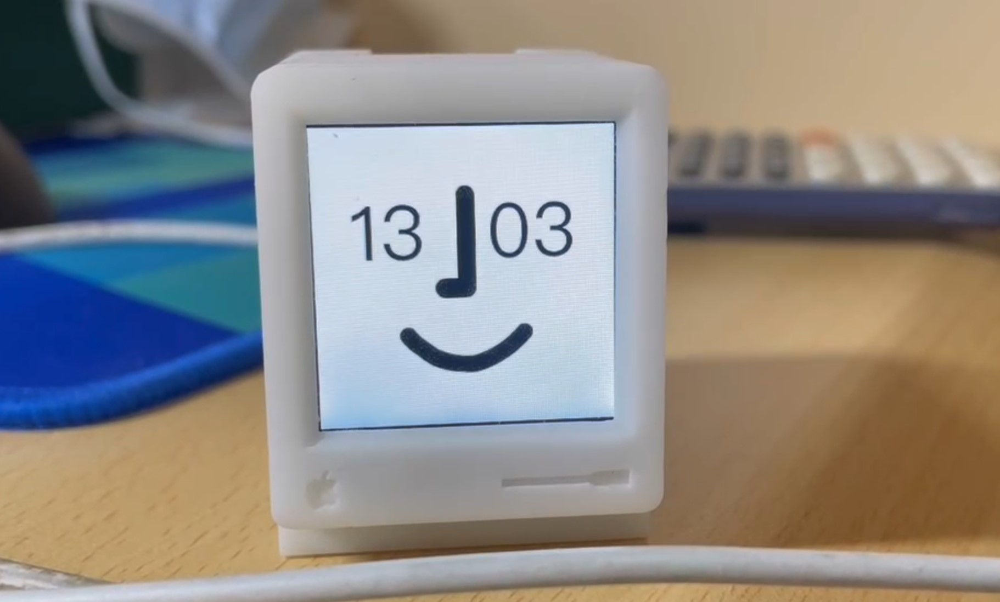
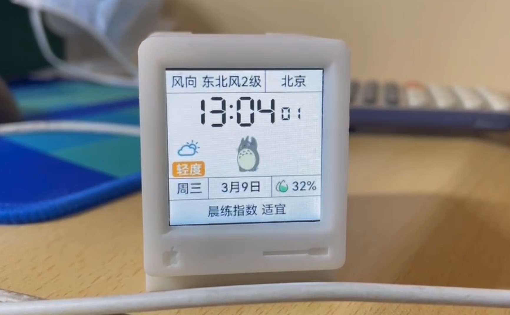

# MiniMac

## 简介
基于ESP32-Arduino的可爱的桌面时钟。

是模仿 https://www.bilibili.com/video/BV1xR4y1x7fo 的实现方式，具体功能可以看这个视频~ 作者本人因故不开源，自己又觉得很可爱，就自己实现了一份，感谢原作者的创意！

## 结构
- 硬件设计 ./Hardware
- 3D打印模型 ./Module
- 软件 ./Software

具体使用方式详见各个文件夹下的README。

## 参考资源&致谢
- Xutoubee 桌面小电视 （主体源码参考） https://oshwhub.com/xmz0916/esp32-desktop-tv
- 韩同学 （模型与创意） https://www.bilibili.com/video/BV1xR4y1x7fo